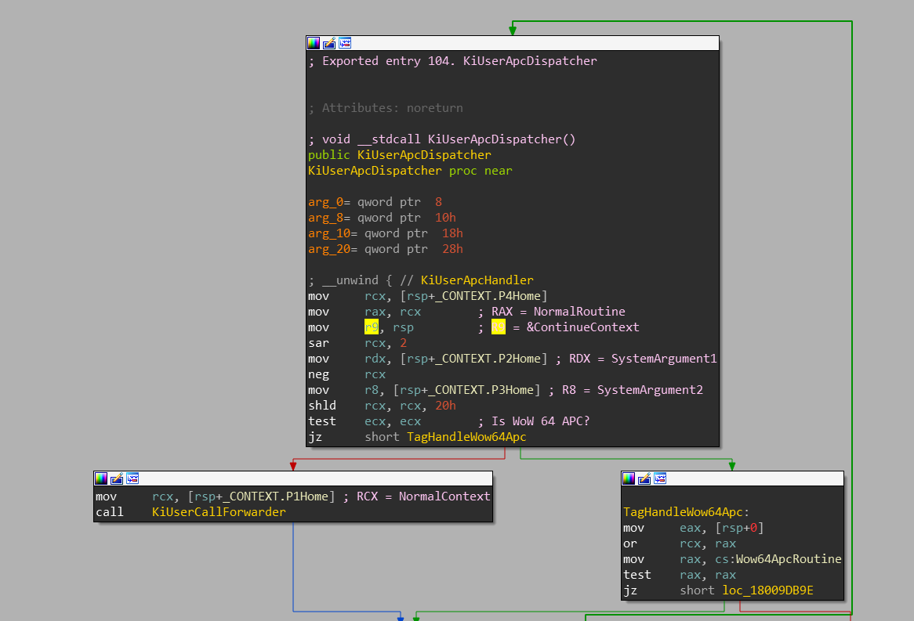
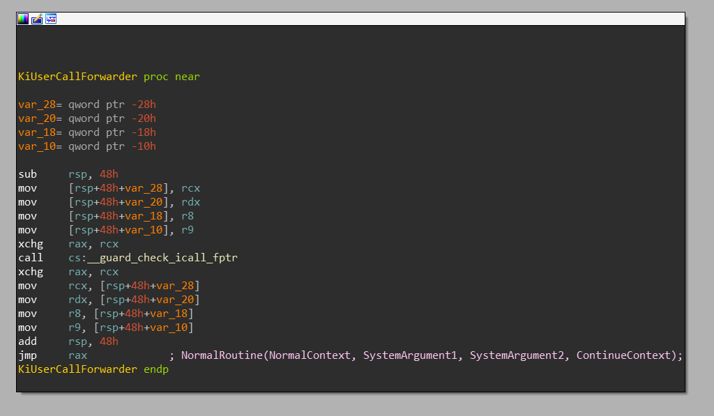
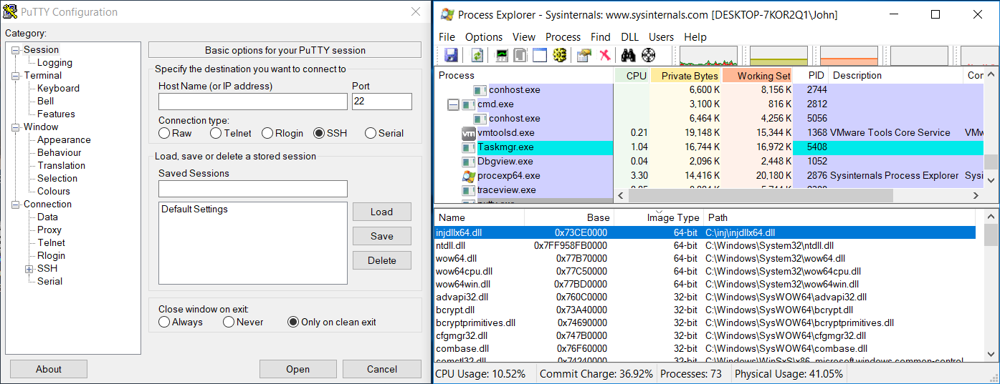
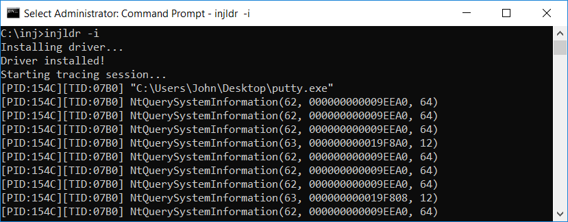

# injdrv

injdrv is a proof-of-concept Windows Driver for injecting DLL into user-mode processes using APC.

### Motivation

Even though [APCs][apc] are [undocumented to decent extent][inside-apc], the technique of using them to inject a DLL
into a user-mode process is not new and has been talked through many times. Such APC can be queued from regular
user-mode process (seen in [Cuckoo][apc-cuckoo]) as well as from kernel-mode driver (seen in [Blackbone][apc-blackbone]).

Despite its popularity, finding small, easy-to-understand and actually working projects demonstrating usage of this
technique isn't very easy. This project tries to fill this gap.

### Features

- Support for **Windows 7** up to **Windows 10**
- Support for **x86**, **x64**, **ARM32** & **ARM64** architectures
- Ability to inject **Wow64** processes
    - With DLL of the same architecture as the **injected process** (e.g. **x86 DLL into x86 Wow64 process**)
    - With DLL of the same architecture as the **OS** (e.g. **x64 DLL into Wow64 process on Windows x64**)
- DLL is injected in very early process initialization stage
    - Injection is performed from the `PsSetLoadImageNotifyRoutine` callback
    - Native processes (e.g. x86 on Windows x86, x64 on Windows x64, ...) are injected on next load of DLL after `ntdll.dll`
    - Wow64 processes are injected on next load of DLL after the Wow64-DLLs are loaded
- Because of that, injected DLL must depend only on `ntdll.dll`
- Demonstrative DLL performs hooking of few `ntdll.dll` functions
    - Achieved using [DetoursNT][DetoursNT]
- Detoured functions use `ETW` to trace hooked function calls

### Compilation

Because [DetoursNT][DetoursNT] project is attached as a git submodule, which itself carries the [Detours][Detours]
git submodule, you must not forget to fetch them:

`git clone --recurse-submodules git@github.com:wbenny/injdrv.git`

After that, compile this project using Visual Studio 2017. Solution file is included. The only required dependency
is [WDK][wdk].

### Implementation

When the driver is loaded, it'll register two callbacks:
- For process create/exit notification ([`PsSetCreateProcessNotifyRoutineEx`][MSDN-CreateProcessNotify])
- For image load notification ([`PsSetLoadImageNotifyRoutine`][MSDN-LoadImageNotify])

When a new process is created, the driver allocates small structure, which will hold information relevant to the process
injection, such as:
- Which DLLs are already loaded in the process
- Addresses of important functions (such as `LdrLoadDll` in `ntdll.dll`)

Start of a new Windows process is followed by mapping `ntdll.dll` into its address space and then ongoing load of DLLs
from the process's import table. In case of **Wow64** processes on Windows x64, the following libraries are loaded
immediately after native `ntdll.dll`: `wow64.dll`, `wow64cpu.dll`, `wow64win.dll` and second (Wow64) `ntdll.dll`.
The driver is notified about load of these DLLs and marks down this information.

When these DLLs are loaded, it is safe for the driver to queue the user-mode APC to the process, which will load our
DLL into the process.

### Challenges

Although such project might seem trivial to implement, there are some obstacles you might be facing along the way.
Here I will try to summarize some of them:

#### "Thunk"-method

_This method injects DLL of the same architecture as the process. This method is available on all architectures._

Injection of DLL requires a small allocation inside of the user-mode address space. This allocation
holds path to the DLL to be injected and a small thunk (shellcode), which basically calls `LdrLoadDll` with the DLL path as
a parameter. It is obvious that this memory requires `PAGE_EXECUTE_READ` protection, but the driver has to fill this
memory somehow - and `PAGE_EXECUTE_READWRITE` is unacceptable security concern.

It might be tempting to use `ZwAllocateVirtualMemory` and `ZwProtectVirtualMemory` but unfortunatelly, the second
function is exported only since Windows 8.1.

The solution used in this driver is to create section ([`ZwCreateSection`][MSDN-CreateSection]), map it
([`ZwMapViewOfSection`][MSDN-MapViewOfSection]) with `PAGE_READWRITE` protection, write the data, unmap it
([`ZwUnmapViewOfSection`][MSDN-UnmapViewOfSection]) and then map it again with `PAGE_EXECUTE_READ` protection.

With usage of sections another problem arises. Since this driver performs injection from the image load notification
callback - which is often called from the `NtMapViewOfSection` function - we'd be calling `MapViewOfSection`
recursively. This wouldn't be a problem, if mapping of the section wouldn't lock the `EPROCESS->AddressCreationLock`.
Because of that, we would end up in deadlock.

The solution used in this driver is to inject **kernel-mode APC** first, from which the `ZwMapViewOfSection` is called.
This kernel-mode APC is triggered right before the kernel-to-user-mode transition, so the internal `NtMapViewOfSection`
call won't be on the callstack anymore (and therefore, `AddressCreationLock` will be unlocked).

Injection of our DLL is triggered on first load of DLL which happens after all important system DLLs (mentioned above)
are already loaded.

In case of native processes, the codeflow is following:
- `process.exe` is created (process create notification)
- `process.exe` is loaded (image load notification)
- `ntdll.dll` is loaded (image load notification)
- `kernel32.dll` is loaded (image load notification + **injection happens here**)

In case of Wow64 processes, the codeflow is following:
- `process.exe` is created (process create notification)
- `process.exe` is loaded (image load notification)
- `ntdll.dll` is loaded (image load notification)
- `wow64.dll` is loaded (image load notification)
- `wow64cpu.dll` is loaded (image load notification)
- `wow64win.dll` is loaded (image load notification)
- `ntdll.dll` is loaded (image load notification - note, this is 32-bit ntdll.dll)
- `kernel32.dll` is loaded (image load notification + **injection happens here**)

<br>

> **NOTE:** Load of the `kernel32.dll` was used as an example. In fact, load of any DLL will trigger the injection.
> But in practice, `kernel32.dll` is loaded into **every Windows process**, even if:
> - it has no import table
> - it doesn't depend on `kernel32.dll`
> - it does depend only on `ntdll.dll` (covered in previous point, I just wanted to make that crystal-clear)
> - it is a console application
>
> Also note that the order of loaded DLLs mentioned above might not reflect the exact order the OS is performing.
>
> The only processes that won't be injected by this method are:
> - native processes (such as `csrss.exe`)
> - pico processes (such as applications running inside [Windows Subsystem for Linux][WSL])
> 
> Injection of these processes is not in the scope of this project.
>
> **NOTE:** On Windows 7, the Wow64 loads `kernel32.dll` and `user32.dll` (both native and Wow64) into the process.
> Unfortunatelly, this load is performed in the initialization of Wow64 (by `wow64!ProcessInit`), therefore on Windows 7
> we have to wait until these DLLs are loaded as well before injecting a Wow64 process.

The injected user-mode APC is then force-delivered by calling `KeTestAlertThread(UserMode)`. This call internally
checks if any user-mode APCs are queued and if so, sets the `Thread->ApcState.UserApcPending` variable to `TRUE`.
Because of this, the kernel immediately delivers this user-mode APC (by `KiDeliverApc`) on next transition from
kernel-mode to user-mode.

> If we happened to not force the delivery of the APC, the APC would've been delivered when the thread would be in
> the alertable state. (There are two alertable states per each thread, one for kernel-mode, one for user-mode;
> this paragraph is talking about `Thread->Alerted[UserMode] == TRUE`.) Luckily, this happens when the Windows loader
> in the `ntdll.dll` finishes its job and gives control to the application - particularly by calling `NtAlertThread`
> in the `LdrpInitialize` (or `_LdrpInitialize`) function.  So even if we happened to not force the APC, our DLL would
> still be injected before the main execution would take place.
>
> **NOTE:** This means that if we wouldn't force delivery of the APC on our own, the APC would be delivered **BEFORE**
> the `main`/`WinMain` is executed, but **AFTER** all [TLS callbacks][TLS-callbacks] are executed. This is because
> TLS callbacks are executed also in the early process initialization stage, within the `LdrpInitialize` function.
>
> This behavior is configurable in this project by the `ForceUserApc` variable (by default it's `TRUE`).
>
> **NOTE:** Some badly written drivers try to inject DLL into processes by queuing APC at wrong time. For example:
> - Queuing an APC for injecting DLL that **doesn't depend only on ntdll.dll** right when **ntdll.dll** is mapped
> - Queuing an APC for injecting DLL that **depends on kernel32.dll** right when **kernel32.dll** is mapped (but not loaded!)
>
> Such injection will actually work as long as someone won't try to forcefully deliver user-mode APCs. Because this
> driver triggers immediate deliver of user-mode APCs (**all of them**, you can't pick which should be delivered),
> it might happen that APC of other driver will be triggered. If such APC consisted, let's say, of calling
> `LoadLibraryA` from `kernel32.dll` and the `kernel32.dll` won't be fully loaded (just mapped), such APC would fail.
> And because this injection happens in early process initialization stage, this error would be considered critical
> and the process start would fail. Also because basically every process is being injected, if start of every process
> would fail, it would make the system very unusable.

The reason why our DLL is not injected immediately from the `ntdll.dll` image load callback is simple: the image
load callback is called when the DLL is mapped into the process - and at this stage, the DLL is not fully initialized.
The initialization takes place **after** this callback (in user-mode, obviously). If we would happen to inject
`LdrLoadDll` call before `ntdll.dll` is initialized, the call would fail somewhere in that function, because some
variable it relies on would not be initialized.

Injection of **Wow64** processes is handled via `PsWrapApcWow64Thread(&NormalContext, &NormalRoutine)` call. This
function essentially alters provided arguments in a way (not covered here) that `KiUserApcDispatcher` in native
`ntdll.dll` is able to recognize and handle such APCs differently. Handling of such APCs is internally resolved
by calling `Wow64ApcRoutine` (from `wow64.dll`). This function then emulates queuing of "32-bit APC" and resumes
its execution in `KiUserApcDispatcher` in the Wow64 `ntdll.dll`.

#### "Thunkless"-method

_This method injects x64 DLL into both x64 (native) and x86 (Wow64) processes. This method is available only on Windows x64._

Injection of **x64 DLL** into **Wow64** processes is tricky on its own, and **SentinelOne** wrote an excellent 3-part
blogpost series on how to achieve that:
- https://www.sentinelone.com/blog/deep-hooks-monitoring-native-execution-wow64-applications-part-1
- https://www.sentinelone.com/blog/deep-hooks-monitoring-native-execution-wow64-applications-part-2
- https://www.sentinelone.com/blog/deep-hooks-monitoring-native-execution-wow64-applications-part-3

In short, if you try to use the same approach as with "thunk"-method for injecting x64 DLL into Wow64 process,
you will run into problems with [Control Flow Guard][MSDN-CFG] on Windows 10.
- On x64 system, CFG maintains 2 bitmaps for Wow64 processes
  - One for "x86 address space" (used when checking execution of < 4GB memory)
  - One for "x64 address space" (used when checking execution of >= 4 GB memory)
- You cannot allocate memory in > 4GB range (even from the kernel-mode), because of [VAD][VAD] that reserves this
  memory range
  - You can theoretically unlink such VAD from `EPROCESS->VadRoot` and decrement `EPROCESS->VadCount`, but that's
    highly unrecommended
- That means, when you allocate memory inside of Wow64 process (even from the kernel-mode) or change its protection,
  the _x86 CFG bitmap_ is used.
- x64 `ntdll.dll` is mapped **above** 4GB, therefore, the `KiUserApcDispatcher` function is also located in > 4GB
  address.
- Before `KiUserApcDispatcher` calls (indirectly) the `NormalRoutine` provided to the `KeInitializeApc` function,
  it checks whether `NormalRoutine` can be executed via CFG
- Because `KiUserApcDispatcher` is called from > 4GB address, this CFG check is performed on _x64 CFG bitmap_, but
  this check will fail, because the allocated memory of ours is in < 4GB memory
  - You can theoreticaly work around this by disabling the CFG with various hacks, but that's also highly
    unrecommended
- `ZwProtectVirtualMemory` and even `ZwSetInformationVirtualMemory` won't help you, because these APIs will operate
  on _x86 CFG bitmap_ as well, if you feed them with < 4GB address

The solution outlined in the **SentinelOne** blogpost rests in calling `LdrLoadDll` of x64 `ntdll.dll` directly
from the user APC dispatcher - effectively, making `NormalRoutine` point to the address of the `LdrLoadDll`.
The issue here is that `PKNORMAL_ROUTINE` takes only 3 parameters, while `LdrLoadDll` takes 4.

```c
typedef
VOID
(NTAPI *PKNORMAL_ROUTINE) (
  _In_ PVOID NormalContext,
  _In_ PVOID SystemArgument1,
  _In_ PVOID SystemArgument2
  );

NTSTATUS
NTAPI
LdrLoadDll (
  _In_opt_ PWSTR SearchPath,
  _In_opt_ PULONG DllCharacteristics,
  _In_ PUNICODE_STRING DllName,
  _Out_ PVOID *BaseAddress
  );
```

  Note that 4th parameter of the `LdrLoadDll` **must** point to some valid address, where the `BaseAddress` will
  be stored. The devil is always in the details - the solution takes advance of "couple of lucky coincidences":
- `KiUserApcDispatcher` is a function expecting `RSP` to point to the `CONTEXT` structure
- From this structure, values `P1Home` ... `P4Home` are fetched:
  - `P1Home` (moved to `RCX`) represent `NormalContext`
  - `P2Home` (moved to `RDX`) represent `SystemArgument1`
  - `P3Home` (moved to `R8`) represent `SystemArgument2`
  - `P4Home` (moved to `RAX`) represent `NormalRoutine`
  - Also, `R9` is set to point to the `RSP` (the `CONTEXT` structure)
  - Note that `RCX`, `RDX`, `R8` and `R9` are used as first four function parameters in [Microsoft x64 calling convention][x64-abi]

  <p align="center">
    
  </p>

- `KiUserApcDispatcher` calls `KiUserCallForwarder`
  - `KiUserCallForwarder` checks whether `RAX` points to valid execution target (in _x64 CFG bitmap_)
  - `KiUserCallForwarder` calls function pointed by `RAX` with parameters `RCX`, `RDX`, `R8` and `R9`
  - This is basically equivalent of calling APC's `PKNORMAL_ROUTINE`
    - `NormalRoutine(NormalContext, SystemArgument1, SystemArgument2)`
  - ...except that, because `R9` is set, it is in fact called like this:
    - `NormalRoutine(NormalContext, SystemArgument1, SystemArgument2, ContinueContext)`

  <p align="center">
    
  </p>

- Therefore, if we queue the user-mode APC like this:
  - `NormalRoutine` = address of `LdrLoadDll` in 64-bit `ntdll.dll`
  - `NormalContext` = `NULL` (translates to 1st param. of `LdrLoadDll` (`SearchPath`))
  - `SystemArgument1` = `NULL` (translates to 2nd param. of `LdrLoadDll` (`DllCharacteristics`))
  - `SystemArgument2` = pointer to `UNICODE_STRING DllName` (translates to 3rd param. of `LdrLoadDll` (`DllName`))
  - (as mentioned above, the 4th parameter (`BaseAddress`) will be provided automatically by the `KiUserApcDispatcher`)
- ...it will effectively result in the following call: `LdrLoadDll(NULL, 0, &DllName, &ContinueContext)`
- `LdrLoadDll` overwrites first 8 bytes of the `CONTEXT` structure, which happens to be its `P1Home` field
- It doesn't break anything, because this field has been already used (when fetching `NormalContext`) and is
  no longer accessed (not even by `ZwContinue`)

> **NOTE:** Not all function calls from x86 NTDLL end up in x64 NTDLL. This is because some functions are fully
> implemented on its own in both x86 and x64 NTDLL. This applies mainly on functions that does not require any
> syscall - i.e. `Rtl*` functions. For example, if you wanted to hook `RtlDecompressBuffer` in Wow64 process,
> hooking that function in x64 NTDLL wouldn't have any effect and such hooked function would be never called.
>
> **NOTE:** Because of differences in APC-dispatching mechanism, this method is not possible to use on **x86** or
> **ARM64** Windows.

#### "wow64log.dll reparse"-method

_This method injects native DLL into all processes. This method is available on all architectures._

When **Wow64** process is starting, the `wow64.dll` tries to load `wow64log.dll`. This DLL is never present in
regular Windows installation (it's probably used internally by Microsoft for debugging of the Wow64 subsystem).
Therefore, load of this DLL will normally fail. This isn't problem, though, because no critical functionality of
the Wow64 subsystem depends on it. If the load actually succeeds, it tries to find following exported functions
in the DLL:
- `Wow64LogInitialize`
- `Wow64LogMessageArgList`
- `Wow64LogSystemService`
- `Wow64LogTerminate`

If one of these functions is not exported by the DLL, the DLL is immediately unloaded.

If we drop custom `wow64log.dll` (which exports functions mentioned above) into the `%SystemRoot%\System32` directory,
it gets loaded into every **Wow64 process**.

For more details, this method is greatly described by [Walied Assar][wow64log]

The actual injection of **Wow64** processes by **injdrv** is handled via redirection of `wow64log.dll` path to the
path of our native DLL. This redirection is solved via filter driver, which registers `IRP_MJ_CREATE` pre-callback.
When this pre-callback detects that the `wow64log.dll` file is being opened, it replaces the path in the `FILE_OBJECT`
by using [`IoReplaceFileObjectName`][MSDN-IoReplaceFileObjectName] function and returning `STATUS_REPARSE` in the
`IO_STATUS_BLOCK`. The code of the filter driver is entirely based on [SimRep][SimRep] example found in Microsoft's
WDK examples.

> **NOTE:** Because native processes do not load `wow64.dll`, **injdrv** injects them using **"thunk"-method** when
> **"wow64log.dll reparse"-method** is selected.
>
> **NOTE:** Because `wow64.dll` itself is compiled for native architecture, the `wow64log.dll` must be also native.

#### Protected processes

Injection of protected processes is simply skipped, as it triggers code-integrity errors. Such processes are detected
by the `PsIsProtectedProcess` function. If you're curious about workaround of this issue (by temporarily unprotecting
these processes), you can peek into [Blackbone source code][blackbone-unprotect-process]. Keep in mind that
unprotecting protected processes requires manipulation with undocumented structures, which change dramatically
between Windows versions.

#### ETW logging

Finally, as mentioned in the beginning, the injected DLL performs logging of hooked functions with ETW.
Because functions such as `EventRegister`, `EventWriteString`, ... are located in the `advapi32.dll`, we can't
use them from our NTDLL-only dependent DLL. Luckily, ETW support is hardwired in the `ntdll.dll` too. In fact,
most of the `Event*` functions in the `advapi32.dll` are simply redirected to the `EtwEvent*` functions in `ntdll.dll`
without any change to the arguments! Therefore, we can simply mock the `Event*` functions and just include the
`<evntprov.h>` header:

```c
//
// Include support for ETW logging.
// Note that following functions are mocked, because they're
// located in advapi32.dll.  Fortunatelly, advapi32.dll simply
// redirects calls to these functions to the ntdll.dll.
//

#define EventActivityIdControl  EtwEventActivityIdControl
#define EventEnabled            EtwEventEnabled
#define EventProviderEnabled    EtwEventProviderEnabled
#define EventRegister           EtwEventRegister
#define EventSetInformation     EtwEventSetInformation
#define EventUnregister         EtwEventUnregister
#define EventWrite              EtwEventWrite
#define EventWriteEndScenario   EtwEventWriteEndScenario
#define EventWriteEx            EtwEventWriteEx
#define EventWriteStartScenario EtwEventWriteStartScenario
#define EventWriteString        EtwEventWriteString
#define EventWriteTransfer      EtwEventWriteTransfer

#include <evntprov.h>
```

...easy, wasn't it?

### Usage

> Following example is performed on **Windows 10 x64**

Enable [Test-Signing][test-signing] boot configuration option (note that you'll need administrative privileges to use
`bcdedit`) and reboot the machine:

```
bcdedit /set testsigning on
shutdown /r /t 0
```

Now open administrator command line and run following command:

`injldr -i`

The `-i` option installs the driver. After the driver is installed, it waits for newly created processes.
When a new process is created, it is hooked. Prepare some **x86** application, for example, [PuTTY][putty] and run it.
With **Process Explorer** we can check that indeed, our x64 DLL is injected in this x86 application.

<p align="center">
    
</p>

Also, immediately after `injldr` is started, it starts an ETW tracing session and prints out information
about called hooked functions:

<p align="center">
    
</p>

You can exit `injldr` by pressing `Ctrl+C`. Now you can run `injldr` without any parameters to just start
the tracing session. If you wish to uninstall the driver, run `injldr -u`.

> This driver by default uses following injection methods:
> - `InjMethodThunk` on Windows x86
> - `InjMethodThunkless` on Windows x64
> - `InjMethodWow64LogReparse` on Windows ARM64
>
> Therefore, it always tries to inject native DLL into all processes, including Wow64 processes. If you wish to
> change this behavior and e.g. inject x86 DLL into x86 Wow64 process, set injection method to `InjMethodThunk`.
> Also, do not forget to compile `injdll` for the corresponding architectures and place it in the same directory
> as `injldr.exe`.

### License

This software is open-source under the MIT license. See the LICENSE.txt file in this repository.

Dependencies are licensed by their own licenses.

If you find this project interesting, you can buy me a coffee

```
  BTC 12hwTTPYDbkVqsfpGjrsVa7WpShvQn24ro
  LTC LLDVqnBEMS8Tv7ZF1otcy56HDhkXVVFJDH
```

  [apc]: <https://docs.microsoft.com/en-us/windows/desktop/sync/asynchronous-procedure-calls>
  [inside-apc]: <http://www.drdobbs.com/inside-nts-asynchronous-procedure-call/184416590>
  [apc-cuckoo]: <https://github.com/cuckoosandbox/monitor/blob/7c5854fae12e1f01f56eab2db4008148c790cc7a/bin/inject.c#L375>
  [apc-blackbone]: <https://github.com/DarthTon/Blackbone/blob/master/src/BlackBoneDrv/Loader.c#L638>
  [Detours]: <https://github.com/Microsoft/Detours>
  [DetoursNT]: <https://github.com/wbenny/DetoursNT>
  [MSDN-CreateProcessNotify]: <https://docs.microsoft.com/en-us/windows-hardware/drivers/ddi/content/ntddk/nf-ntddk-pssetcreateprocessnotifyroutineex>
  [MSDN-LoadImageNotify]: <https://docs.microsoft.com/en-us/windows-hardware/drivers/ddi/content/ntddk/nf-ntddk-pssetloadimagenotifyroutine>
  [MSDN-CreateSection]: <https://docs.microsoft.com/en-us/windows-hardware/drivers/ddi/content/wdm/nf-wdm-zwcreatesection>
  [MSDN-MapViewOfSection]: <https://docs.microsoft.com/en-us/windows-hardware/drivers/ddi/content/wdm/nf-wdm-zwmapviewofsection>
  [MSDN-UnmapViewOfSection]: <https://docs.microsoft.com/en-us/windows-hardware/drivers/ddi/content/wdm/nf-wdm-zwunmapviewofsection>
  [MSDN-CFG]: <https://docs.microsoft.com/en-us/windows/desktop/secbp/control-flow-guard>
  [VAD]: <https://resources.infosecinstitute.com/finding-enumerating-processes-within-memory-part-2/>
  [x64-abi]: <https://en.wikipedia.org/wiki/X86_calling_conventions#Microsoft_x64_calling_convention>
  [blackbone-unprotect-process]: <https://github.com/DarthTon/Blackbone/blob/43bc59f68dc1e86347a76192ef3eadc0bf21af67/src/BlackBoneDrv/Inject.c#L144>
  [WSL]: <https://docs.microsoft.com/en-us/windows/wsl/faq>
  [TLS-callbacks]: <http://www.hexblog.com/?p=9>
  [test-signing]: <https://docs.microsoft.com/en-us/windows-hardware/drivers/install/the-testsigning-boot-configuration-option>
  [PuTTY]: <https://www.chiark.greenend.org.uk/~sgtatham/putty/>
  [wdk]: <https://docs.microsoft.com/en-us/windows-hardware/drivers/download-the-wdk>
  [MSDN-IoReplaceFileObjectName]: <https://docs.microsoft.com/en-us/windows-hardware/drivers/ddi/content/ntifs/nf-ntifs-ioreplacefileobjectname>
  [SimRep]: <https://github.com/Microsoft/Windows-driver-samples/blob/master/filesys/miniFilter/simrep/simrep.c>
  [wow64log]: <http://waleedassar.blogspot.com/2013/01/wow64logdll.html>